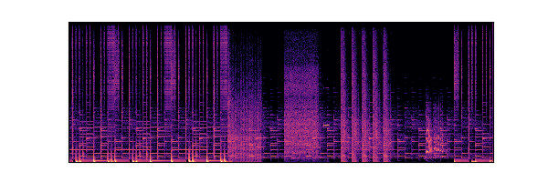

# music_classification
An image-based classification of music genres using CNNs on spectrograms.

## Background
Recommender systems are prevalent in most interactions as a retail customer. Spotify also uses complex recommender systems to suggest music to its users. While most recommender systems follow a collaborative filtering system, I intend to improve that by supplementing the classification of genres with a novel technique.

## Implementation

This is a spectrogram from the song Gang - Yung Kartz: http://freemusicarchive.org/music/Yung_Kartz/April_2018/Gang.

It represents the song graphically by showing the variation in frequency/pitch (Y-axis) over time (X-axis) as well as the amplitude/volume (colour).

By approaching this from an image-based implementation where the model learns a genre from an album of spectrograms, we get to save on tedious feature engineering work.

